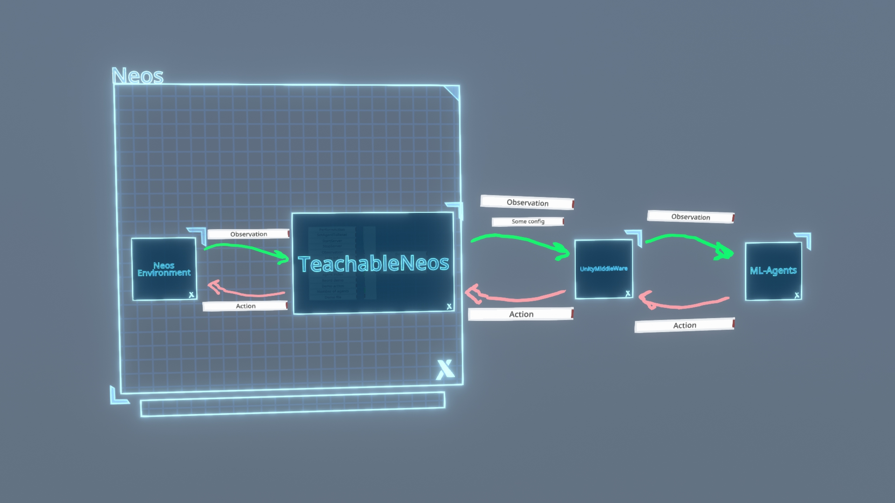
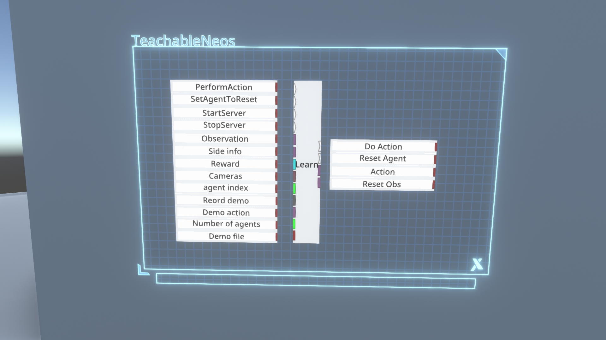
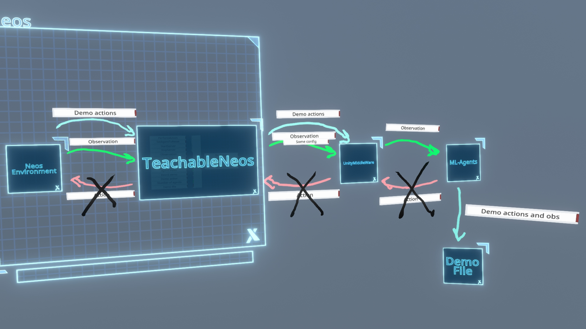
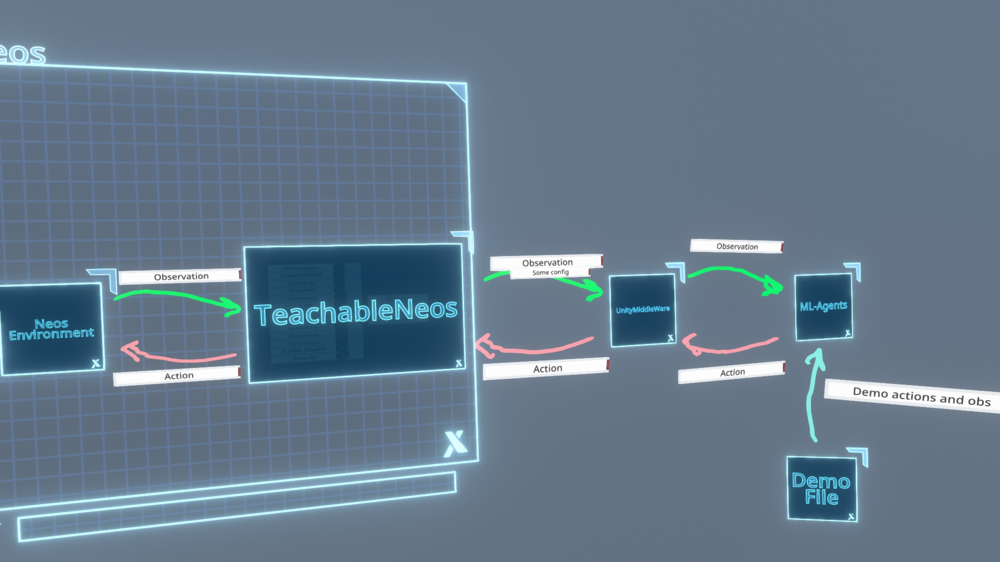

Hi, welcome to VRAI (VR AI). This is a project to integrate the latest AI technologies into the latest VR technologies (with a focus on social VR). We are starting this long-term journey with reinforcement learning in social VR, using ML-Agents and NeosVR.

Here is the page of the project, which started as a research project in the Oxford AI student society: http://oxai.org/socialvr-ai. We also have a discord channel: https://discord.gg/HQ8Crcw, and a [couple of](https://docs.google.com/document/d/1QVXs_M1yCFSS0QU0ZtPwBJPwRGJJOXqJmiJ_OoFwIyk/edit?usp=sharing) [Google docs]( https://docs.google.com/document/d/1_GhhYuYZBoCrgRzgp7adigoduGQmtOnopPdiNXcxktg/) with the original proposal.

Check out a sister project, [Neptune](https://github.com/guillefix/neptune) where I am integrating Jupyter into NeosVR which will also allow for other kinds of AI experiments!

In the following we give an overview of the system, that should be enough to get you started. You should also check out the "TL;DR example" if you just want to see what scripts to run without necessarily understanding what you are doing XD. See also the "Instructions for development" if you want to modify the code of the plugin or other parts of the system

## Overview of system

To understand this system you need some basic understanding of [Reinforcement learning](https://www.wikiwand.com/en/Reinforcement_learning#/Introduction). Reinforcement learning (RL for short) is what ML people call the task of "learning to act succesfully in an environment". There are many many algorithms that have been developed for this. [Here](https://www.youtube.com/watch?v=qv6UVOQ0F44&ab_channel=SethBling) is a simple video that gives a nice intuitive introduction to an RL problem, with its main concepts including **actions**, **observations**, **agent**, and **reward**, and trains using an algorithm called "neuroevolution". [Here](https://medium.com/hackernoon/intuitive-rl-intro-to-advantage-actor-critic-a2c-4ff545978752) is another nice explanation (following a cute fox trying to find its food!) of a very different algorithm called Advantage Actor-Critic. You don't need to understand the details of the algorithms to use RL, specially with libraries like ML-Agents which are trying to make the techniques easier to use for everyone! But if you want to get *really technical* there's plenty of material out there, including [this course](https://www.youtube.com/watch?v=2pWv7GOvuf0&list=PLqYmG7hTraZDM-OYHWgPebj2MfCFzFObQ) from DeepMind.

In short the key concepts are:

* **agent** is the name given to the thing that decides which actions to take (what one may call "an AI" or "an NPC"). There may be many agents in the environment
* **observation** is the input to the agent, it's what "it sees". In some places "observation" is called "state", although "state" technically refers to the state of the whole environment, not all of which the agent may observe.
* **action** is the output of the agent, it's what it decides to do
* **reward** is a number that the agent receives every time that it performs an action. If it's big and positive, like +50, then we consider the action "good"; if it's big but negative, like -50, then we consider it "bad".

RL algorithms try to make the agent learn which actions will lead to the largest *cumulative* reward, that is the most reward summed up over time. You can also find more info on the [ML-Agents page](https://github.com/Unity-Technologies/ml-agents/blob/master/docs/ML-Agents-Overview.md#a-quick-note-on-reward-signals).

The following image gives a high level overview of the current system.

* **TeachableNeos** is the plugin for Neos found under `environment/neos` which manages the communication of observations and actions from Neos to the rest of the machine learning (ML) pipeline. We will see in more detail how it works later. For now we just need to know that it is implemented as a big logix node which you embed within a Neos world and it is up to you, the designer of the environment/agent, to decide what the agent receives as observation, and what its actions do in the world.
* **UnityMiddleWare** (UMW for short) is a hack that may be removed eventually, but it works so xD. Basically, ML-Agents is a library that has been developed to train RL agents in Unity environments. So I made an empty unity environment whose only purpose is to redirect actions from ML-Agents to Neos and redirect observations from Neos to ML-Agents. It currently handles also some other things, like deciding what is the maximum time the agent can run before resetting (which in particular resets the cumulative reward count to 0).
* **ML-Agents** is the python library which actually does machine learning. It takes the observations, including the rewards, from the middleware (which come from Neos), and uses an RL algorithm to train a neural network to get a little bit better, in average, over time at getting high reward. As we will see, ML-Agent may also read a set of "demonstrations" from a human showing what are good actions for the task, and use that to help its learning (this technique is called imitation learning, as it is trying to imitate the human).

### TeachableNeos

This is the Learn node included in TeachableNeos with a description of its different inputs and outputs. The plugin also includes several other logix nodes which are useful. The only two which are necessary are `To Array` and `Unpack Array`. All of the nodes are in a new folder called `VRAI`.

*Inputs*

* **PerformAction** This impulse should be called every Update when we are training/running ML-Agents. It basically tells the node to do one step, defined as sending the observations to ML-Agents, and waiting for its actions. Once I update the UMW to support "on-demand" actions rather than continuously-updating actions, then we may not call it every update, but this isn't implemented yet:P
* **SetAgentToReset**. This informs ML-Agent that the agent should be restarted. This is useful for instance if you have a finite arena where the agent is fumbling around, then if the agent gets too far it may not be learning anything useful, so it's better to reset it. 
* **StartServer** and **StopServer**. These impulses manually start and stop the gRPC server which the node uses to communicate with UMW. This is necessary for instance if you change the agent_index, as I'll explain later. Note that you shouldn't have several sessions in neos with Learn nodes lying around because they may interfere with each other (they will try to use the same port), unless you manually set the agent_index to avoid this, as we'll see.
* **Observation** This receives an Array of floats which represents what the agent sees or senses. You need to use the `To Array` node to connect to this.
* **Side info** This is an experimental option that allows to save extra info that can then be retreived at resets. Useful for restarting an agent in a state found in a demonstration. This one isn't fully tested at the moment..
* **Reward** This is a float representing the reward that the agent will receive at the current step (and thus associate with its last action, though some delay between actions and rewards is Ok too, as RL is designed to account for that by maximizing the reward acumulated over time).
* **Cameras** You can plug an array of cameras here (if nothing is plugged in, then it only uses the floats in Obs as observation). You can use the `To Camera Array` node which takes `Camera` components. This will include the visual feed of the cameras as an observation for the agent! Of course this doesn't work in headless clients because it needs Unity in Neos to Render. I recommend very low resolution cameras like 84x84 pixels. A single camera was what was used for [this example](https://www.youtube.com/watch?v=qi19IGvNBck&ab_channel=GuillermoValle) of an agent learning to find a virus.
* **Agent index** This is an integer that should be set to a different value for each agent in the scene. In fact they should go consequetively. If there are 5 agents, their indices should be 0,1,2,3,4. This internally sets their port used for gRPC communication with UMW, so it needs to be different for each.
* **Record demo** A Boolean which when true means that we are in "recording demonstration mode" (see next section), and when False we are not (we are going to train instead). This information is sent to UMW together with a few other config info
* **Demo action** This should be an array of floats containing the actions corresponding to the demo. This is used when recording a demo. However, it should be plugged in before even if not, because it sets the size of the action array . So in particular the output action array will have a size determined by what you plug in here. So even if you are not recording demo you should plug in an empty array here of the right size, using the `To Array` node.
* **Number of agents** This should be set to the total number of agents (learn nodes) in the environment
* **Demo file**. This is a file where to store the side info. As I said this is only experimental for now, so can be ignored.

*Outputs*

* **Do Action** this is an impulse triggered when the Learn node has received an action from UMW (from ML-Agents), so you should use it to trigger the effect of the action (which is found in `Action` output)
* **Reset Agent** is triggered when the agent should reset (because the maximum number of steps per episode is reached), or because you triggered `SetAgentToReset`.
* **Action** is the float array of actions received from ML-Agents. You should use `Unpack array` node to convert it to floats
* **Reset Obs** this a random sample from the info stored in side info. This is currently experimental, so can be ignored.

*Under the hood*

TeachableNeos is using [gRPC](https://grpc.io/docs/languages/csharp/basics/) to communicate with the UnityMiddleWare. This server is tarted `OnStart` of the node.
Every time the node receives a "PerformAction" trigger, if it is connected to ML-Agents it will wait until ML-Agents sends a `SendAct` request which sends the actions from UMW to the Learn node. This always happens afte a `GetObs` request which makes the Learn node return the actions to UMW. There are several other RPC to handle the communication between the TeachableNeos and UMW. Tbh now I'm thinking that websockets may be more flexible, but gRPC is one of the fastest inter-process communication tech. 

### UnityMiddleWare

The unity middleware is compiled in `environment/neos/built_env`, but if you want to inspect it/develop it, its source is a Unity project in `environment/neos/UnityMiddleWare2`. 
It includes an environment called `testenv` with a single `Agent`, and a `VoidEnvSettings`

the agent scripts (as well as some extensions to ML-Agents to the camera feeds from Neos) are found here

`TestAgent.cs` is the main script controlling the relaying of information between ML-Agents and Neos. More info about how Unity Environments for ML-Agents work can be found [here](https://github.com/Unity-Technologies/ml-agents/blob/master/docs/Learning-Environment-Create-New.md). It's possible you may need to manuall install the `com.unity.ml-agents` Unity package as explained [here](https://github.com/Unity-Technologies/ml-agents/blob/master/docs/Installation.md).

The Environment settings (which in our case just manages the duplication of the Agent game object in case there are several agents) is found in this script

### ML-Agents

ML-Agents is a powerful library which we are currently using to give all the ML-power to this system. [Here](https://github.com/Unity-Technologies/ml-agents/blob/master/docs/ML-Agents-Overview.md)'s an overview. In our case the most important things will be

* **mlagents-learn** is a command line utility which is installed when installing ml-agents. You can install ML-Agents version 0.20.1 by clonning [the ml-agents repo](https://github.com/Unity-Technologies/ml-agents), and running the two commands [here](https://github.com/Unity-Technologies/ml-agents/blob/master/docs/Installation.md#advanced-local-installation-for-development-2) . Depending on your python installation you may need to use `pip` rather than `pip3` for those commands. If you don't have python installed already, I recommend using Anaconda (https://docs.anaconda.com/anaconda/install/windows/) which will give you an Anaconda terminal which has a python environment set up nicely.
** Because of the UWM, ML-Agent doesn't really notice anything different, and you can use every option it offers (only some options are not implemented in the UMW but those don't affect mlagents-learn itself). You can read [here](https://github.com/Unity-Technologies/ml-agents/blob/master/docs/Training-ML-Agents.md#training-with-mlagents-learn) about how to use mlagents-learn, or you can see the "TL;DR example below" for an example script I made.
* **training config** these are `yaml` files passed to mlagents-learn which specify a lot of options specifying things from what type of neural network to use, to how long to train from, to what parameters to use for the RL algorithm. If you are using imitation learning (see next section) here you need to specify where the recorded demo files are. You can see the `eco_npc_config.yaml` for an example. An explanation of every option available for the training config file (the `yaml` file) can be found [here](https://github.com/Unity-Technologies/ml-agents/blob/master/docs/Training-Configuration-File.md).

We will pass the option `--env="..\..\environment\neos\built_env\Unity Environment"` to specify that we will use the built/compiled UMW. For debugging you can also not pass any `--env` option and then it will ask you to press play in the Unity editor, which you can do after opening the UMW in Unity.

### Recording demonstrations for imitation learning

As alluded to before, one way we can teach the agent is via imitaion learning. For more info, see [here](https://github.com/Unity-Technologies/ml-agents/blob/master/docs/ML-Agents-Overview.md#imitation-learning). Basically rather than just giving it rewards, you can give it actions. So for example, you can remote control an NPC that is trying to find trees (or you can use a hard-coded rule, like for the Eco NPC example), and feed your actions to the `demo_actions` variable of the learn node, while `recording_demo=True`. Note that in the training config file from ML-Agents you need to specify the demo file, which will be created under `..\..\environment\neos\built_env\Unity Environment_Data\Demonstrations` if you recorded the demo using the compiled UMW. 

The main algorithm used when imitation learning is called GAIL. One of its options is `use_actions`. If you set it to `false` it will try to imitate the actions in the demonstation, if `false`, it will ignore the actions and only try to imitate the observations (which you can think of trying to imitate the outcomes, not how you got to the outcomes, which is useful in cases where you are controlling the NPC with a different set of controls than it will then use during learning).

Here's how the pipeline looks like when recording a demo

When training with demo (which happens whenever you include either `behavioural_cloning` or `gail` inside the training options, it will then be as normal training, but it will be using the recorded demo file

## TL;DR example

The following is a TL;DR of how to run an example. But it may be more worth going to the next sections to understand the system better

### Set up

- Install NeosVR
- Install Python. In windows, I recommend using Anaconda (https://docs.anaconda.com/anaconda/install/windows/) which will give you an Anaconda terminal which has a python environment set up nicely.
- Install ML-Agents (version 0.20.1) by clonning the ml-agents repo, and running the two commands [here](https://github.com/Unity-Technologies/ml-agents/blob/master/docs/Installation.md#advanced-local-installation-for-development-2) . Depending on your anaconda installation you may need to use `pip` rather than `pip3` for those commands.
- Copy the dlls in `environment/neos/dlls/Libraries` to the `Libraries` folder in the Neos installation folder (from now on refered to as "Neos folder"), often in `C:\Program Files (x86)\Steam\steamapps\common\NeosVR`. (I have more than you probably need in there, but just to be safe)
- Copy the files `run_neos_vrai_desktop.bat`, `run_neos_vrai_vr.bat`, and `run_neos_vrai_desktop_record_demo.bat` in `environment/neos/dlls` to Neos folder. These files start Neos with the plugin loaded in, in either desktop or VR mode respectively. They currently will load the Eco world as an example environment.
<!--- The current training uses imitation learning, and that requires a demo file.-->

### Training
Run the file `nani_kore.bat` in `agent/mlagents` which will run `run_neos_vrai_desktop.bat` to start the Neos environment and then after 50s will run the command `mlagents-learn eco_npc_config.yaml --run-id=test_eco_demo_new3 --env="..\..\environment\neos\built_env\Unity Environment" --time-scale=2.0` which will run mlagents for training from scratch, using the settings found in `eco_npc_config.yaml`. `run-id` is the name of the current experiment. The script actually loops over this command because for some reason Neos freezes every several minutes when doing this, I don't konw why yet. 
More details on options for mlagents-learn are [here](https://github.com/Unity-Technologies/ml-agents/blob/master/docs/Training-ML-Agents.md)
Details on the options for the training config file (the `yaml` file) are [here](https://github.com/Unity-Technologies/ml-agents/blob/master/docs/Training-Configuration-File.md)

### Recording demo
You can run `nani_kore_record_demo.bat`in `agent/mlagents` which will run the same commands as above but using `run_neos_vrai_desktop_record_demo.bat` which starts a version of the Eco environment with a single agent, and a the record_demo inside Neos set to true

## Instructions for development

### Set up

- Do all of the setup in the TL;DR example.
- Install Visual Studio (VS) Community edition

### Modifying the TeachableNeos.dll (the thing that connects Neos with external world, i.e. Unity for now)

- Open `environment/neos/TeachableNeos/TeachableNeos/TeachableNeos.csproj` which should open with VS.
- Edit there. `ServeData.cs` is the file with the Neos plugin itself. `DataCommImpl.cs` has the RPC functions (see [here](https://grpc.io/docs/tutorials/basic/csharp/) to learn more about RPC, and the gRPC library)
- Press Build>Build solution or ctrl+shift+B to build the solution (which should update the dll in the Neos folder, *if installed in the default location*)
- If you edit `basic_comm.proto` (which defines the RPC messages), then you'll need to save, close VS, and run `environment/neos/make_for_win.bat` to recompile them.

### Modifying the UnityMiddleware

- As explained above, the main scripts are in `Assets/VoidEnvironment/Scripts` in the UnityMiddleWare2 project. The main functionality is in `TestAgent.cs` which request obsevations from TeachableNeos's gRPC server, and sends it actions. `TextureSensor.cs` and `TextureSensorComponent.cs` define a custom ML-Agents sensor to implement visual observsations via an image array received from Neos, rather than a Unity camera. Just save after making any modification and that's it.
- Build the environment into the built_env folder.

### Modifying Neos environment.

- You can create or modify any Neos environment and include the Learn node in them. Explaining how to build with Neos is beyond the scope of this documentation, but ProbablePrime has a nice series of [videos about world building in Neos](https://www.youtube.com/user/ahref), and the community (in discord or Neos itself) is very helpful.
- Refer to the above for the meaning of the different input/outputs for the Learn node.

### ML-Agents

You can also modify ML-Agents itself if you are brave, and familiar with Tensorflow. You can do that by cloning their repo. You would need to run the [two installation commands](https://github.com/Unity-Technologies/ml-agents/blob/master/docs/Installation.md#advanced-local-installation-for-development-2) to use the modified library.

-----

_More stuff todo_

* support for on-demand decisions
* support for discrete actions, and masking
* experiments with Betali, to learn high-dimensional actions (like full 18 dof control of heads and hands), and comparisong of different techniques, including supervised learning, using the new [Neptune](https://github.com/guillefix/neptune) system!
* improvements to work flow
* try to fix bug which causes Neos to reset every several minutes.
* Experiments with multi-agent imitation learning
* Experiments with adversarial and cooperative multi-agent tasks, as well as self-play
* Experiments with curiosity-driven learning
* more stuff?
* Try to use Neptune/websockets to reduce dependence on plugins for the workflow. The idea is to make ML/RL as user-friendly as possible so everyone can use it!

-----

Agents

- **Alphali**. Only three actions (x-z velociy and y-rotation). Succesfully learnt simple find-and-reach task with only visual observations.
- **Betali**. Full d.o.f. control of head and both hands (position+rotation). Observations are visual + current pose. Actions and pose are parametrized relative to itself in a way that doesn't rely on any global coordinates, to help generalization. Learn some simple motion, but still not showing satisfactory results.
- **Eco NPCS**. From Anmoalous et al.'s Eco world. These NPCs can be programmed to do several things. At the moment they are programmed to reach targets (trees, rocks, or places in the village where these should go). This is the one in the current TL;DR example

----

Disclaimer: `.bat` files in this repo have been tested and free from coronavirus.
